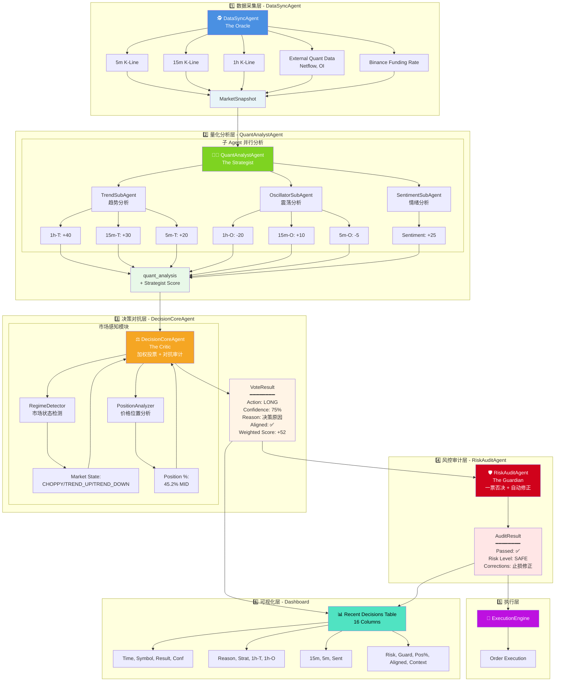

# Multi-Agent 数据流转架构图

## 数据流转说明

### 层级 1: 数据采集 (蓝色)

- **DataSyncAgent** 异步并发采集多周期数据
- 输出: `MarketSnapshot` (包含 5m/15m/1h 数据 + 外部量化数据)

### 层级 2: 量化分析 (绿色)

- **QuantAnalystAgent** 协调 3 个子 Agent
  - **TrendSubAgent**: 输出 1h-T, 15m-T, 5m-T
  - **OscillatorSubAgent**: 输出 1h-O, 15m-O, 5m-O
  - **SentimentSubAgent**: 输出 Sentiment Score
- 输出: `quant_analysis` + Strategist 综合评分

### 层级 3: 决策对抗 (橙色)

- **DecisionCoreAgent** 执行加权投票
- 集成 **RegimeDetector** (市场状态) 和 **PositionAnalyzer** (价格位置)
- 输出: `VoteResult` (Action, Confidence, Reason, Aligned, Weighted Score)

### 层级 4: 风控审计 (红色)

- **RiskAuditAgent** 执行最终审核
- 自动修正止损方向、杠杆、仓位
- 输出: `AuditResult` (Passed, Risk Level, Corrections)

### 层级 5: 执行 (紫色)

- **ExecutionEngine** 执行订单

### 层级 6: 可视化 (青色)

- **Recent Decisions Table** 展示所有 Agent 数据 (16列)
